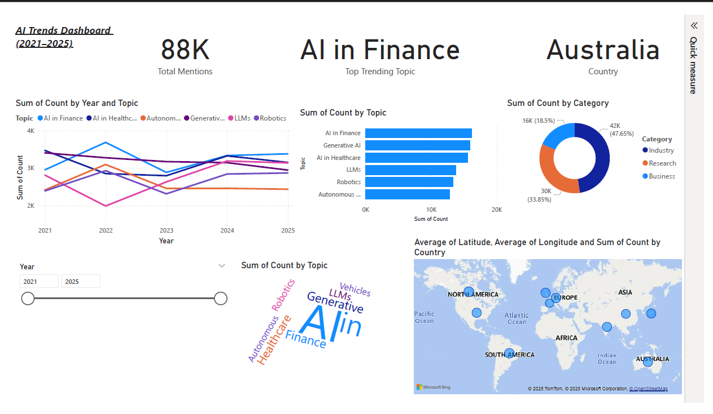
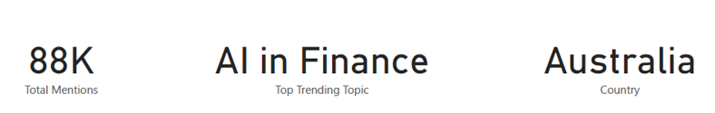
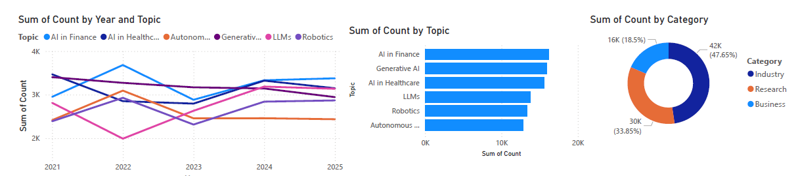
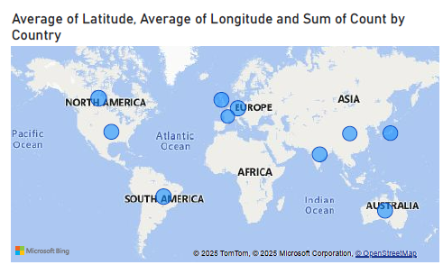

# 📊 AI Trends Dashboard (2021–2025)

This project analyzes **global AI adoption trends** from 2021 to 2025 using Power BI.  
It showcases skills in **data visualization, storytelling, and analytics**.

---

## 🚀 Features
- KPIs: Total Mentions, Top Topic, Top Country
- Line Chart: Yearly trend of AI adoption
- Bar Chart: Top AI topics by mentions
- Donut Chart: Distribution across Research, Industry, Business
- Map: Country-wise adoption using coordinates
- Slicer: Year filter for interactive analysis
- Word Cloud (optional): Popular topics

---

## 📂 Files in this Repository
- `AI_Trends_Extended_WithCoords.csv` → dataset
- `AI_Trends_Dashboard.pbix` → Power BI project file
- `report.pdf` → detailed project report
- `images/` → dashboard snapshots

---

## 🔑 Key Insights
- Finance & Healthcare dominate AI mentions across all years  
- Industry adoption is higher than Research & Business  
- US, China, and India are top adopters  
- Generative AI & LLMs surge in 2024–2025  

---

## 📊 Dashboard Preview

  

## 🔑 Key KPIs

  

## 📈 AI Research Trends

  

## 🌍 Regional Analysis

  

---

## 📌 Skills Demonstrated
- Power BI
- Data Cleaning & Visualization
- Dashboard Design
- Storytelling with Data

---
